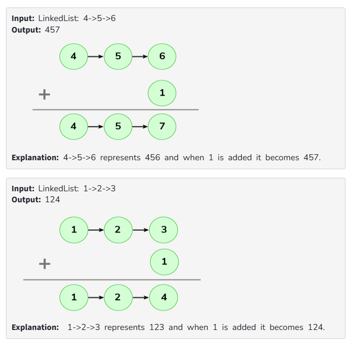

# Add 1 to a Linked List Number

You are given a linked list where each element in the list is a node and has an integer data.  
You need to add 1 to the number formed by concatenating all the list node numbers together and return the head of the modified linked list.  

**Note:** The head represents the first element of the given list.

---

## Examples

---

## Constraints
1 ≤ len(list) ≤ 10^5  
0 ≤ list[i] ≤ 9  

**Expected Time Complexity:** O(n)  
**Expected Auxiliary Space:** O(1)
