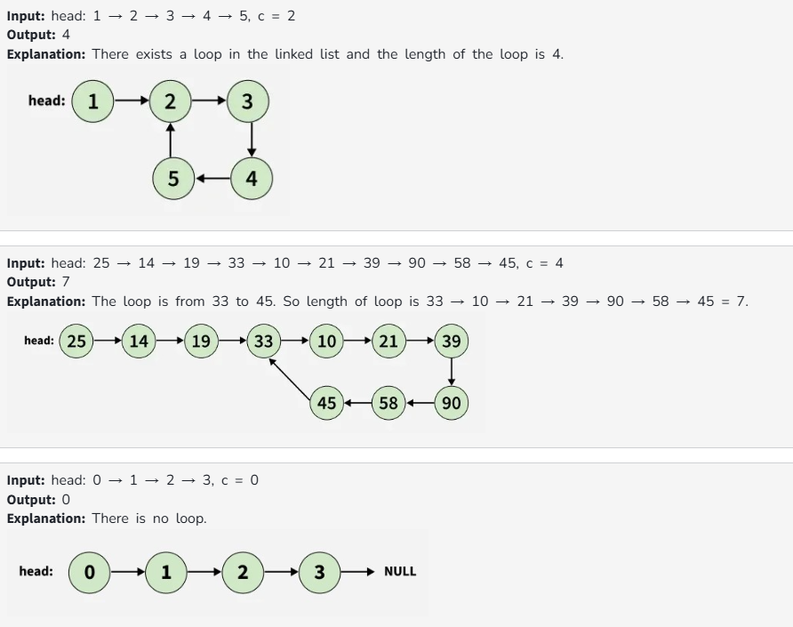

# Find length of Loop

Given the head of a linked list, determine whether the list contains a loop.  
If a loop is present, return the number of nodes in the loop, otherwise return 0.

**Note:** 'c' is the position of the node which is the next pointer of the last node of the linked list.  
If c is 0, then there is no loop.

---

## Examples

## Constraints
1 ≤ list size ≤ 10^5  
0 ≤ node->data ≤ 10^4  
0 ≤ c < list size
