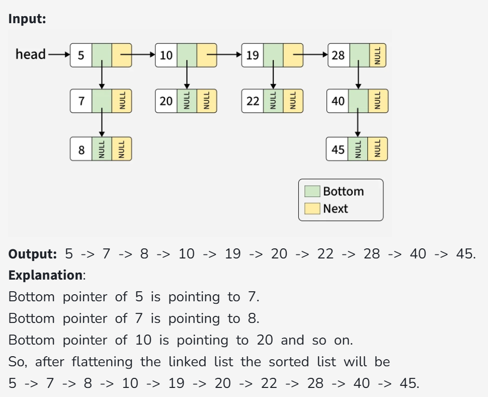
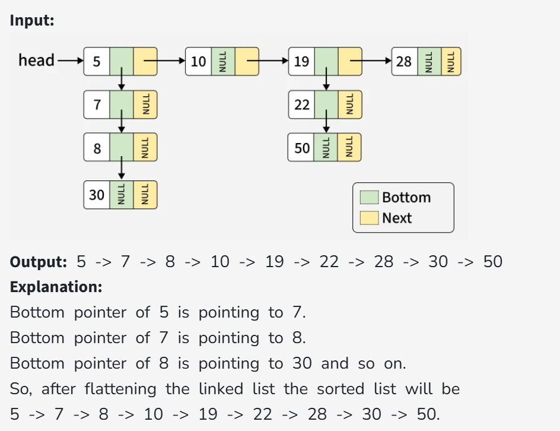

# Flattening a Linked List

Given a linked list containing n head nodes where every node in the linked list contains two pointers:  
(i) `next` points to the next node in the list.  
(ii) `bottom` points to a sub-linked list where the current node is the head.

Each of the sub-linked lists nodes and the head nodes are sorted in ascending order based on their data.  
Flatten the linked list such that all the nodes appear in a single level while maintaining the sorted order.

**Note:**

1. ↓ represents the bottom pointer and → represents the next pointer.
2. The flattened list will be printed using the bottom pointer instead of the next pointer.

---

### Example 1:



---

### Example 2:



```

### Constraints:

- 0 ≤ n ≤ 100
- 1 ≤ number of nodes in sub-linked list(mi) ≤ 50
- 1 ≤ node->data ≤ 10⁴
```
