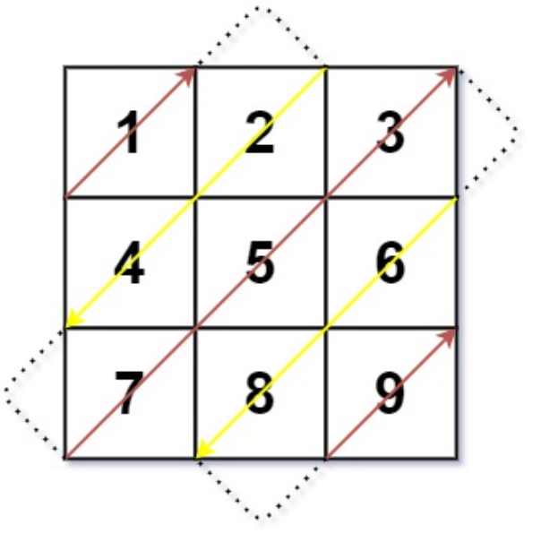

# Diagonal Traverse

Given an **m x n** matrix `mat`, return an array of all the elements of the matrix in **diagonal order**.

---

## Example 1:

**Input:**  
mat = [[1,2,3],[4,5,6],[7,8,9]]

**Output:**  
[1,2,4,7,5,3,6,8,9]

---

## Example 2:

**Input:**  
mat = [[1,2],[3,4]]

**Output:**  
[1,2,3,4]

---

## Constraints:

- m == mat.length
- n == mat[i].length
- 1 ≤ m, n ≤ 10⁴
- 1 ≤ m \* n ≤ 10⁴
- -10⁵ ≤ mat[i][j] ≤ 10⁵
