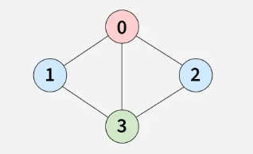

# M-Coloring Problem

You are given an **undirected graph** consisting of **V vertices** and **E edges** represented by a list `edges[][]`, along with an integer **m**.

Your task is to determine whether it is possible to color the graph using at most **m different colors** such that **no two adjacent vertices share the same color**.

Return **true** if the graph can be colored with at most `m` colors, otherwise return **false**.

**Note:** The graph uses 0-based indexing.

---

## Example 1:

**Input:**  
V = 4  
edges = [[0, 1], [1, 3], [2, 3], [3, 0], [0, 2]]  
m = 3

**Output:**  
true

**Explanation:**  
It is possible to color the given graph using 3 colors, for example, one of the possible ways vertices can be colored as follows:

- Vertex 0 → Color 1
- Vertex 1 → Color 2
- Vertex 2 → Color 2
- Vertex 3 → Color 3

---

## Example 2:

**Input:**  
V = 3  
edges = [[0, 1], [1, 2], [0, 2]]  
m = 2

**Output:**  
false

**Explanation:**  
It is not possible to color the given graph using only 2 colors because vertices 0, 1, and 2 form a triangle, requiring 3 different colors.

---

## Constraints:

- 1 ≤ V ≤ 10
- 1 ≤ E = edges.size() ≤ (V \* (V - 1)) / 2
- 0 ≤ edges[i][j] ≤ V - 1
- 1 ≤ m ≤ V
